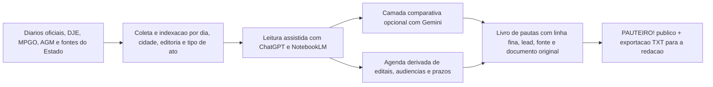

# PAUTEIRO!

Livro de pautas em HTML, CSS e JavaScript para leitura de diarios oficiais de Goias ao longo de 2026.

## Entrada principal

- `pauteiro.html`: frente publica principal.
- `pauteiro-2026-pautas.txt`: saida leve com linha fina e lead das pautas.
- `radar-diarios-goias.html`: alias legado que redireciona para `pauteiro.html`.
- `radar-diarios-goias-cronologia.html`: alias legado da cronologia.
- `radar-diarios-goias-dia.html`: alias legado da pagina diaria parametrica.
- `radar-diarios-goias-data.js`: base principal consumida pela interface.
- `radar-diarios-goias-data.json`: espelho estruturado da base.
- `radar-diarios-goias.css`: estilos da interface.
- `radar-diarios-goias-app.js`: montagem dinamica das paginas.

## Como abrir

- Local: abra `pauteiro.html` no navegador.
- Remoto: [https://raphaelbezerrajor.github.io/radar-diarios-goias/](https://raphaelbezerrajor.github.io/radar-diarios-goias/)

## Fluxo

## Escopo atual

- 2026 entra como caderno anual;
- abril de 2026 esta preenchido ate 18/04/2026;
- calendario por dia;
- cronologia;
- pagina diaria;
- bloco de fluxo do sistema;
- exportacao leve em TXT;
- primeiras entradas de Goiânia, Aparecida de Goiânia, Senador Canedo, Anápolis, AGM, MPGO, Estado de Goiás e TJGO.

## Observacao

O projeto esta em evolucao editorial. A proxima camada inclui agenda derivada do diario, ampliacao por mes e refinamento visual das manchetes e das fotos.
